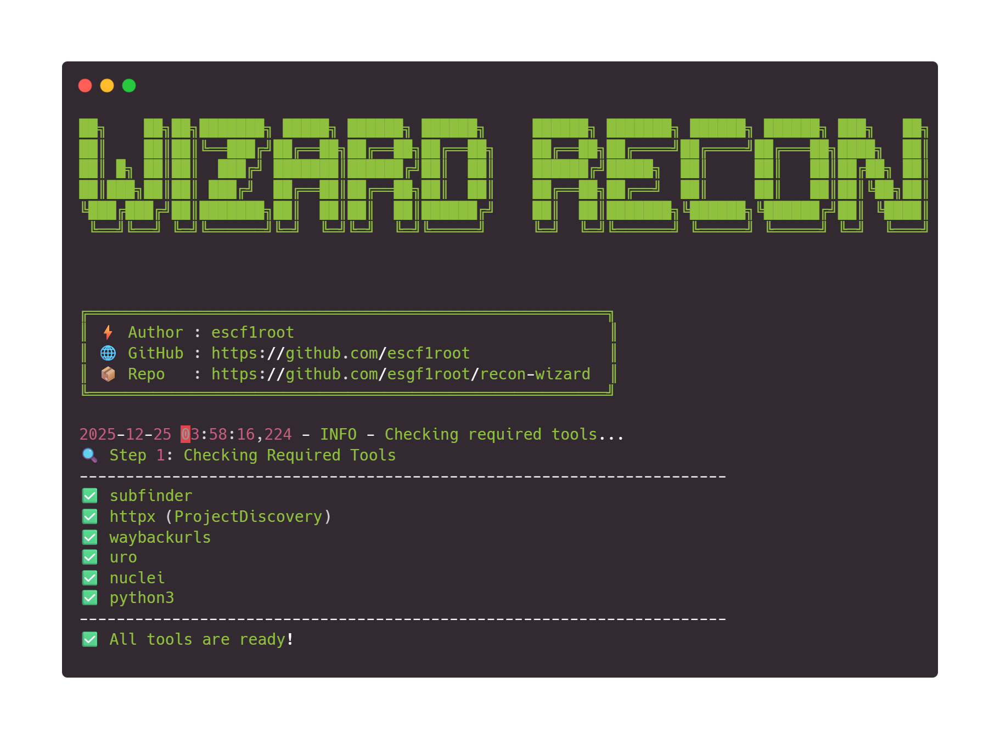

<!-- updated -->
<p align="center">
  
</p>
<p align="center">
  <a href="./LICENSE">
    
  </a>
  <a href="https://github.com/escf1root/recon-wizard">
    
  </a>
  <a href="https://www.python.org/">
    
  </a>
  <a href="https://github.com/escf1root/recon-wizard/issues">
    
  </a>
  <a href="https://github.com/escf1root/recon-wizard/commits/main">
    
  </a>
  <a href="https://github.com/escf1root/recon-wizard">
    
  </a>
</p>

---

## 🔍 About `ReconWizard`

**ReconWizard** is a comprehensive, automated reconnaissance toolkit designed for bug bounty hunters and penetration testers. It streamlines the information gathering process by orchestrating multiple security tools into a seamless workflow, producing actionable intelligence from target domains.

### ✨ Features

- **Subdomain Enumeration**: Leverages `subfinder` to discover subdomains from multiple sources
- **Active Probing**: Uses `httpx` to filter and validate live subdomains
- **Historical Data Mining**: Extracts archived URLs with `waybackurls`
- **URL Deduplication**: Cleans and optimizes URL lists with `uro`
- **Sensitive Data Detection**: Identifies potentially sensitive files and endpoints
- **JavaScript Analysis**: Extracts and analyzes JavaScript files for hidden endpoints and secrets
- **Vulnerability Scanning**: Performs targeted vulnerability scanning with `nuclei`
- **Secret Hunting**: Integrates with `SecretFinder` to detect API keys, tokens, and credentials

### Purpose

ReconWizard automates the tedious process of reconnaissance, allowing security professionals to focus on analysis and exploitation rather than manual data collection. By combining the outputs of specialized tools into a unified workflow, it significantly reduces the time required for initial attack surface mapping.

---

## ⚠️ Critical Notice: Tool Versions

This script is **designed and tested to work with specific versions** of Go-based ProjectDiscovery tools. Using different versions **may cause the script to fail or produce unexpected results**.

### Required Tool Versions

| Tool           | Required Version                     |
| -------------- | ------------------------------------ |
| `katana`       | **v1.1.0**                           |
| `subfinder`    | **latest**                           |
| `httpx`        | ProjectDiscovery Go version (latest) |
| `waybackurls`  | **latest**                           |
| `uro`          | **latest**                           |
| `nuclei`       | **latest**                           |
| `SecretFinder` | Latest compatible version            |

---

## ⚙️ Requirements

### System Requirements

- Linux (tested on Kali Linux)
- Python 3.7+
- Go ( Version go1.24.4 linux/amd64 )

### Tool Dependencies

| Tool           | Description                | Installation Method                                                        |
| -------------- | -------------------------- | -------------------------------------------------------------------------- |
| `subfinder`    | Subdomain discovery        | `go install github.com/projectdiscovery/subfinder/v2/cmd/subfinder@latest` |
| `httpx`        | HTTP toolkit               | `go install github.com/projectdiscovery/httpx/cmd/httpx@latest`            |
| `waybackurls`  | Archive URL fetcher        | `go install github.com/tomnomnom/waybackurls@latest`                       |
| `uro`          | URL deduplication          | `go install github.com/lc/uro@latest`                                      |
| `nuclei`       | Vulnerability scanner      | `go install github.com/projectdiscovery/nuclei/v3/cmd/nuclei@latest`       |
| `katana`       | Web crawler (v1.1.0)       | `go install github.com/projectdiscovery/katana/cmd/katana@v1.1.0`          |
| `SecretFinder` | JavaScript secrets scanner | [GitHub Repository](https://github.com/m4ll0k/SecretFinder)                |

### Python Dependencies

- `colorama` (for colored output)

---

## ⚙️ Setup / Installation

### 📦 One-Line Setup (Recommended)

```bash
git clone https://github.com/escf1root/recon-wizard.git
cd recon-wizard
python3 -m venv .venv
source .venv/bin/activate
pip install -r requirements.txt
```

### 🧩 Installing Required Tools

```bash
# Install Secretfinder
git clone https://github.com/m4ll0k/SecretFinder.git secretfinder
cd secretfinder
pip3 install -r requirements.txt
cd ..

# Install katana v1.1.0
go install github.com/projectdiscovery/katana/cmd/katana@v1.1.0

# Install other required tools
go install github.com/projectdiscovery/subfinder/v2/cmd/subfinder@latest
go install github.com/projectdiscovery/httpx/cmd/httpx@latest
go install github.com/tomnomnom/waybackurls@latest
go install github.com/lc/uro@latest
go install github.com/projectdiscovery/nuclei/v3/cmd/nuclei@latest

```

## Example

```
Automated Reconnaissance Tool

Usage:
  python3 main.py -t <domain> [OPTIONS]

Options:
  -t, --target TARGET           Target domain to scan (e.g., example.com)
  -o, --output-dir OUTPUT_DIR   Directory to save results (default: ./results)
  -sf, --secretfinder-path PATH Path to SecretFinder.py script (default: ./SecretFinder.py)
  -nt, --nuclei-templates PATH  Path to custom Nuclei templates directory.
                                If not provided, default Nuclei templates are used.
  -h, --help                    Show this help message and exit

Example:
  python3 main.py -t example.com -o ./domain -sf /home/kali/secretfinder/ -nt /home/kali/nuclei-templates
```
